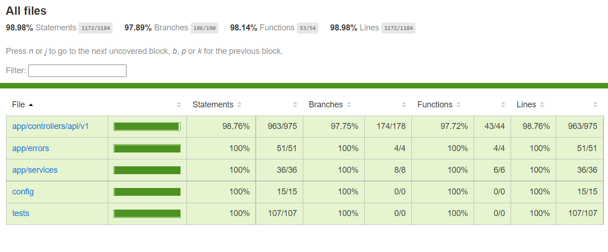
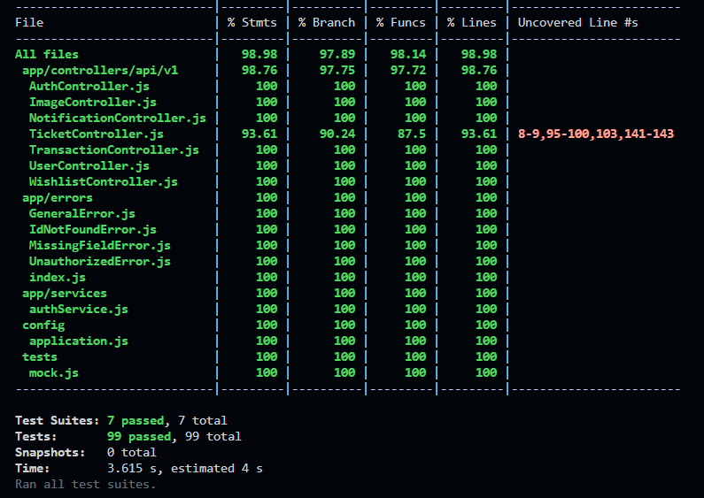

# Gosky Backend API

This is backend API for gosky web and android application as a part of fullstack web and android development course final project.

## Live Application

This application is currently deployed using [railway.app](railway.app).  
You can access this application on [https://gosky.up.railway.app/](https://gosky.up.railway.app/)  
  
Information about server routes and documentation can be seen [here](#routes-and-documentation).

## Running Local App

To run this application in your computer you can follow these steps below.

### Setup Local Server and Database

    npm install

Run this command to install all dependencies needed by this project.

    npm run db:setup

After that, run this command to setup database with sequelize. Remember to setup `.env` file on this project first with your postgres database, cloudinary, and email data. You can follow this example file [here](.env.example). Remember to have your postgres database installed and running. 

### Running Server

    npm start

run this command to start express server normally. To run the server in development mode, use this command instead:

    npm run develop

To run both unit tests, use this command:

    npm test

## Routes, Documentation, and Test Coverage

### Routes and Documentation

Documentation about API is available here:

| Route | Default Local Link | Live Link |
|--|--|--|
| `/documentation` | localhost:8000/docs | https://gosky.up.railway.app/docs/ |

Default admin account data is available and can be changed in local on [`config/admin.js`](config/admin.js) with this as default settings:

    {
      name: 'admin',
      email: 'admin@gmail',
      password: 'admin',
    }

### Test Coverage

Unit and integration tests coverage of this project is ***>98%***, details can be seen on this image below.

